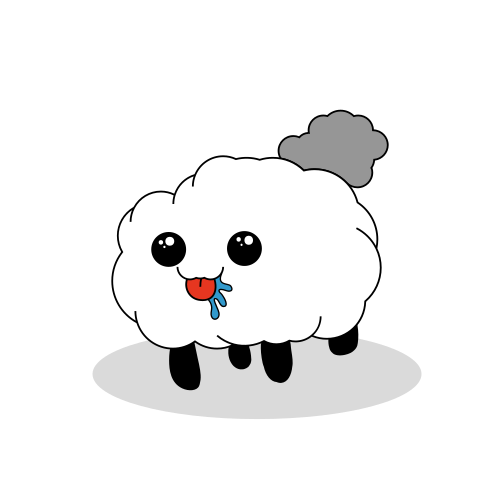

<!-- NguyenNgocChinh -->
# Hi! My name is Nguyễn Ngọc Chinh

<h2 align="center">🛠 Technologies and Tools 🛠</h2>
 
<!-- https://simpleicons.org/ -->

&nbsp;

&nbsp;

&nbsp;

&nbsp;

&nbsp;

&nbsp;

&nbsp;

&nbsp;

&nbsp;

&nbsp;

&nbsp;

&nbsp;

&nbsp;

&nbsp;

 

<h2 align="center">🔥 GitHub Stats 🔥</h2>
<!-- https://github.com/anuraghazra/github-readme-stats -->
 

  
  

 

<h2 align="center">😉 Where to find me 😉</h2>
 
<!-- https://icons8.com (color background: FCE0A2)-->

  
  
  <!--  -->
  
  
  

 

<h2 align="center">📑 Random DEV Quotes 📑</h2>
 
<!-- https://github.com/shravan20/github-readme-quotes -->

<!--  -->

